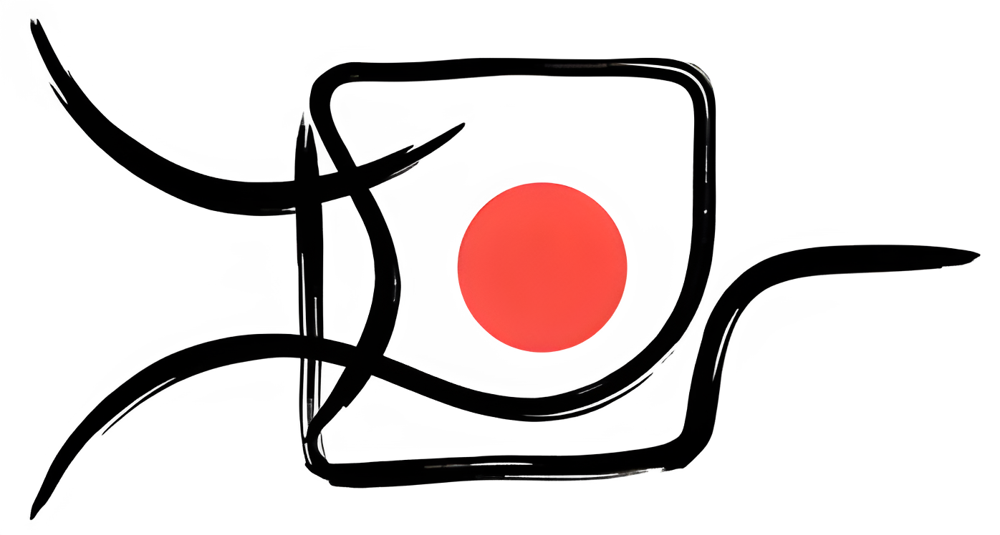

<div align="center">
  
  <h1>whest-docs</h1>
  <p><strong>Unified documentation shell for <code>whest</code> and <code>whestbench</code></strong></p>
</div>

<div align="center">

[](https://github.com/AIcrowd/whest-docs)


</div>

---

`whest-docs` is the separate shared docs repository for the `whest` ecosystem.
It renders product-owned content from `whest` and `whestbench` behind one shell,
while intentionally leaving the current `whest` GitHub Pages site untouched during
phase 1.

## Why This Repo Exists

- Keep the current `whest` docs deployment stable while the unified site is built in parallel.
- Give `whest` and `whestbench` one design language, one landing experience, and one future search surface.
- Preserve source ownership in the product repos instead of moving all docs content into a central monorepo.

## Ownership Model

`whest` owns:
- docs content in `website/content/docs`
- product-specific docs components and MDX registration in `website/docs-kit`

`whestbench` owns:
- docs content in `docs/`
- product-specific docs components and MDX registration in `docs-kit/`

`whest-docs` owns:
- shared layout and branding
- route planning and product landing experience
- source sync and deployment orchestration
- future cross-product navigation, search, and release pinning

## Local Development

Three source modes are supported:

1. `remote + remote`
   Both products resolve from the refs in `config/sources.json`.
2. `local + remote`
   Override one repo locally, for example `WHESTBENCH_PATH=/path/to/whestbench`.
3. `local + local`
   Override both `WHEST_PATH` and `WHESTBENCH_PATH`.

Start the site with:

```bash
npm install
npm run sync:sources
npm run prepare:content
npm run dev
```

Build verification:

```bash
node --test tests/*.test.mjs
npm run build
```

## Source Policy

The active source policy lives in [`config/sources.json`](/Users/mohanty/.codex/worktrees/2706/whest-docs/config/sources.json).

- Phase 1 follows `main` for both source repos.
- Later, the same topology can pin `ref` values to tags or coordinated releases.

## CI And Dispatch Flow

1. `whest` or `whestbench` updates docs-related files on `main`.
2. The source repo sends a `repository_dispatch` event to `AIcrowd/whest-docs`.
3. `whest-docs` checks out both source repositories.
4. The shared site prepares content metadata, builds, and deploys independently.

Required secrets:

- `AICROWD_DOCS_SOURCE_TOKEN` in `whest-docs` for cloning private source repositories during CI.
- `AICROWD_DOCS_DISPATCH_TOKEN` in the source repos for sending dispatch events to `whest-docs`.

There is no automatic back-sync from `whest-docs` into the product repos.
